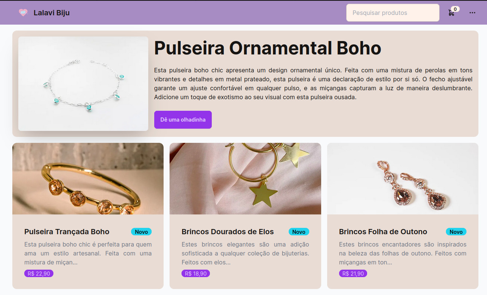

# E-commerce de Miçangas e Bijuterias



Este é um projeto fullstack web desenvolvido utilizando Next.js, Tailwind CSS, NextAuth, Prisma, MongoDB e DaisyUI. O projeto consiste em uma lojinha online para a venda de miçangas e bijuterias.

## Instalação

Certifique-se de ter o Node.js instalado em seu sistema. Em seguida, clone este repositório e execute os seguintes comandos:

```bash
# Instalar as dependências
npm install

# Executar o servidor de desenvolvimento
npm run dev
```

Certifique-se de configurar corretamente o MongoDB e suas credenciais no arquivo `.env`.

## Funcionalidades

- **Autenticação:** Utilizamos o NextAuth para autenticação de usuários, permitindo que eles façam login, cadastro e logout de suas contas.
- **Carrinho de Compras:** Os clientes podem adicionar produtos ao carrinho de compras de forma anônima e que é automaticamene mesclado com o carrinho caso ocorra um login.
- **Visualização Responsiva:** A interface do usuário é totalmente responsiva, garantindo uma experiência consistente em diferentes dispositivos e tamanhos de tela.

## Tecnologias Utilizadas

- **Next.js:** Um framework React que oferece funcionalidades como renderização do lado do servidor e geração de páginas estáticas.
- **Tailwind CSS:** Um framework de CSS utilitário que nos permite criar interfaces bonitas e responsivas.
- **NextAuth:** Uma biblioteca de autenticação para Next.js que suporta vários provedores de autenticação, como Google, Facebook, Twitter, entre outros. Nesse projeto foi utilizado o Google.
- **Prisma:** Um ORM para Node.js e TypeScript, utilizado para interagir com o banco de dados.
- **MongoDB:** Um banco de dados NoSQL utilizado para armazenar os dados dos produtos, usuários e carrinhos.
- **DaisyUI:** Uma biblioteca de componentes Tailwind CSS pronta para uso que facilita a criação de interfaces bonitas e funcionais.
